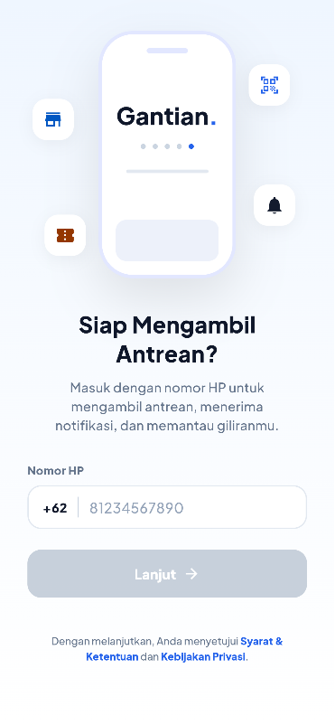
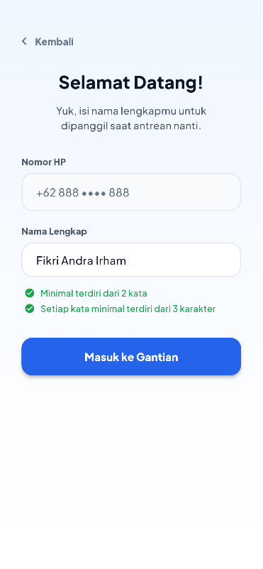
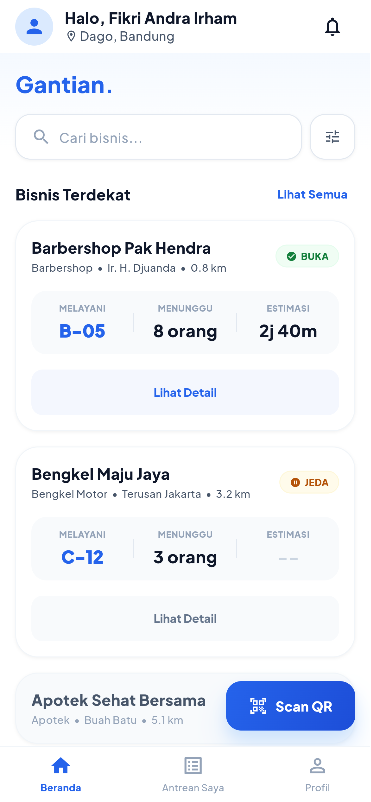
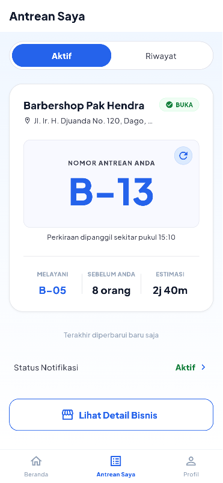
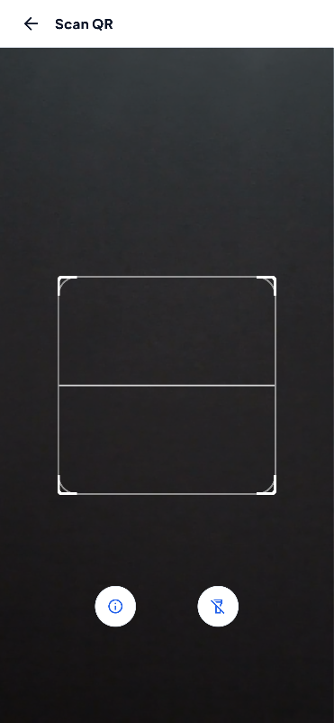
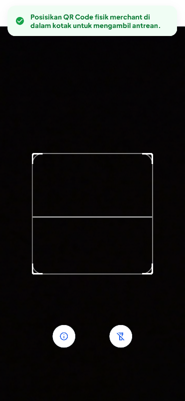
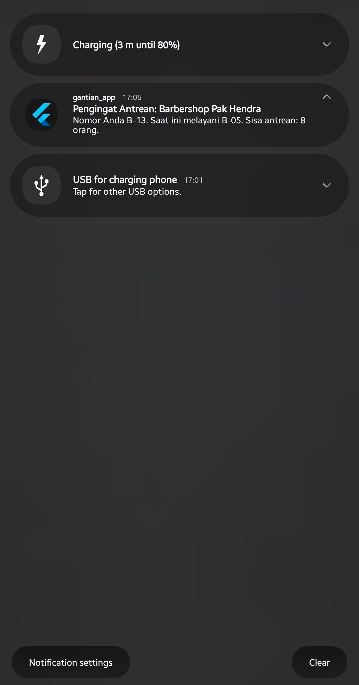

# Gantian - Queue Management Platform for UMKM

[](https://flutter.dev/)
[](https://dart.dev/)
[](https://m3.material.io/)
[](https://www.figma.com/)
 

Gantian is a mobile queue management app for UMKM. It is designed for walk-in businesses such as barbershops, workshops, salons, and local service counters.

The app focuses on a simple workflow. Users can register, access the main dashboard, join or monitor queue-related flows, scan a QR code on site, and receive queue updates through local notifications.

<p align="center">
  
</p>

Figma Design File: [Gantian Mobile Workspace](https://www.figma.com/design/4dznk5E1MJMSJXiNJD95JS/Gantian-App-Mobile?node-id=42-2&t=kJxMV6Q4MYY1dcve-1)

## Features

- Phone number authentication with OTP verification
- Main dashboard with bottom navigation
- Merchant browsing and queue monitoring interface
- REST API integration using MockAPI.io
- State management with Provider
- Local persistence with SharedPreferences
- QR scanning with `mobile_scanner`
- Local notifications with `flutter_local_notifications`
- Reusable UI components for consistent screen behavior

## Tech Stack & Tools

| Tool / Package | Category | Purpose |
| --- | --- | --- |
| Flutter | Framework | Cross-platform mobile application development |
| Dart | Programming Language | Primary language used to build the application |
| Material 3 | UI Framework | Design system for consistent layouts and components |
| Figma | UI/UX Design | Interface design, prototyping, and design reference for Flutter implementation |
| MockAPI.io | Backend Mocking | Provides mock REST endpoints during development and testing |
| `http` | Networking | Performs asynchronous REST API requests and JSON retrieval |
| Provider | State Management | Manages and propagates application state across widgets |
| SharedPreferences | Local Storage | Persists lightweight user data such as login sessions and preferences |
| `mobile_scanner` | Mobile Feature | Enables QR code scanning using the device camera |
| `flutter_local_notifications` | Mobile Feature | Displays scheduled and instant local notifications |
| Plus Jakarta Sans | Typography | Primary font used throughout the application |

## Architecture

The project follows an MVC-based structure with clear separation of responsibilities:

- **Model**: data structures and API response mapping
- **View**: UI screens and widgets
- **Controller**: state handling and app logic

This structure keeps the code easier to read, maintain, and extend. It also reduces logic duplication across screens.

### Folder Overview

```
lib/
├── components/   # Shared UI widgets
├── controllers/  # App logic and state handlers
├── models/       # Data models and JSON mapping
├── services/     # API, storage, scanner, notification services
└── views/        # Screens and UI flows
```

## Scope and Limitations

This version keeps the scope focused on the queue problem only.

* MockAPI is used for development data, so the backend is not a production database.
* Customer flow is limited to on-site usage; remote booking is not included.
* Payment, chat, loyalty, and multi-branch support are not part of this build.
* Notification delivery depends on device permission and platform behavior.
* Offline sync and conflict resolution are outside the current scope.
* Camera scanning requires a supported device and granted camera access.

## Testing

Manual testing was performed on the following areas:

| Test Area        | Checked Behavior                               |
| ---------------- | ---------------------------------------------- |
| Login            | Validation, navigation, and input handling     |
| API Integration  | Data fetch and list rendering from MockAPI     |
| State Management | UI refresh after state changes                 |
| Local Storage    | Saved data persists after app restart          |
| Camera Scan      | QR scanning opens and detects supported codes  |
| Notifications    | Local notification flow triggers correctly     |
| Navigation       | Switching between main tabs works consistently |

## Screenshots

<p align="center">
  
  
</p>

<p align="center">
  <em>Authentication flow: phone number login and user onboarding with real-time form validation.</em>
</p>

<br>

<p align="center">
  
  
</p>

<p align="center">
  <em>Main dashboard: merchant discovery and active queue monitoring.</em>
</p>

<br>

<p align="center">
  
  
</p>

<p align="center">
  <em>Mobile features: QR code scanning and custom toast banner.</em>
</p>

<br>

<p align="center">
  
</p>

<p align="center">
  <em>Local notification triggered by the application.</em>
</p>

## Getting Started

### Prerequisites

Before running the project, ensure the following tools are installed:

- Flutter SDK (3.x or later)
- Dart SDK (included with Flutter)
- Android Studio or Visual Studio Code with the Flutter extension
- Android Emulator, iOS Simulator, or a physical device

Verify your Flutter environment:

```bash
flutter doctor
```

Resolve any reported issues before continuing.

### Installation

Clone the repository and install the required dependencies:

```bash
git clone https://github.com/fikriandrrhm19/gantian-app.git
cd gantian-app
flutter pub get
```

### Run the Application

Launch the application on a connected device or emulator:

```bash
flutter run
```

### Demo Authentication

For demonstration purposes, the authentication flow uses predefined OTP values instead of an SMS verification service.

1. Enter any valid phone number on the login screen.
2. Continue to the OTP verification page.
3. Use one of the following codes:

| OTP | Behavior |
| :-- | :------- |
| `111111` | Simulates a first-time user and continues to the onboarding flow. |
| `123456` | Simulates an existing user and opens the main dashboard. |

> **Note**:
> These OTP values are intended for development and demonstration purposes only. They will be replaced with a production authentication service in future iterations.

## License

This project is licensed under the MIT License. See the LICENSE file for details.